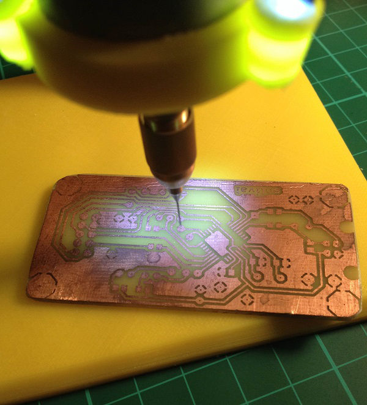

# PCB Drill Press Stand
This is small neat drill press stand designed for laser printer engines widely sold on ebay/aliexpress.
This project based on http://www.thingiverse.com/thing:144333 by Mark Benson design with next improvements:
- Designed for engine body sized L=35-60mm D=30mm
- Added 3x 3mm super light LED holders focused on drill working area
- Added PCB with voltage regulator and connector for standard notebook power unit (which is used for drill and light). This can be easily changed on any power source up to 24v (only connector should be changed in this case).

Apart from that no big changes. I print gears with 40% filament and all other parts with 20% filament. Works fine.

# Photos
Drill Press Stand assembled

---

Drilling area light

---

Assembled render front

---

Assembled render back:

---

LED Light Schematics

---

LED Light board layout

# Bill of Materials
## Mechanics
- ABS or PLA filament
- Drill chuck
- M5 Threaded rod (about 110mm)
- Threaded rod M8 (about 95mm and 80mm). One is for stand, second is for gear and fixed slider.
- 6x M8 nut, nyloc (better 8x for stand tightening)
- 4x 8mm washer
- 9x M3 18mm bolts
- 10x M3 nuts
- 6x 3mm washers
- 6x 3x12mm screws

## Electronics
- Motor from printer with body diameter 30mm and length between 35-60mm
- Female-Female du-pont wires 10cm (6x)
- 3x LED 3mm White
- 2.54mm 2-wire connector
- Jack plug (diameters must match your notebook power unit connector)
- Notebook power unit
- 2x3 pin header male
- LM7805 (or LM7812) voltage regulator
- 0.1uF and 0.33uF capacitors
- 3x 100 Ohm resistors (or 390 Ohm if LM7812 used)
- Prototype Board or etched PCB
